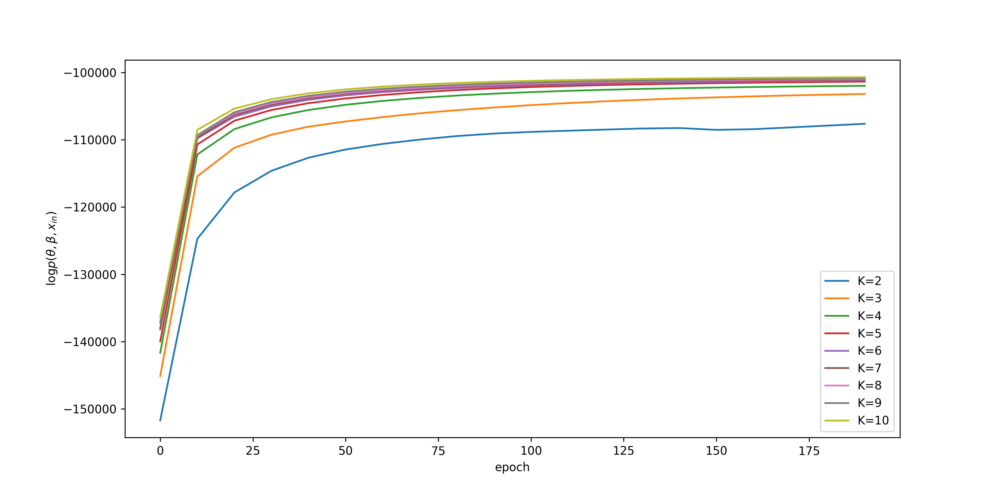
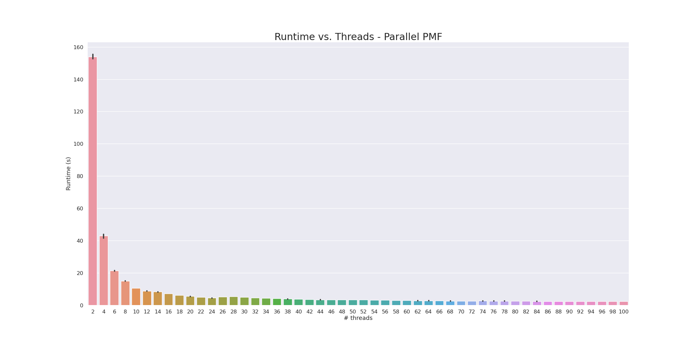

## Tutorial

<b>Overview</b>

Probabilistic Matrix Factorization (PMF) is a popular class of graphical models commonly used for recommender systems. In this project, we provide a parallel implementation of Gaussian matrix factorization. This tutorial briefly covers the basics of PMF models, then delves into the technical details of how to set up and use our application; first for model fitting (section 3) and then for prediction/recommendation (section 4). Users experienced with PMF models may skip section 1, and go directly to the technical prerequisites in section 2.

<b>$\Large\S$ 1. Probablistic Matrix Factorization Basics</b>

Probabilistic Matrix Factorization belongs to a larger class of collaborative filtering models. As opposed to content-based filtering, these models rely on users’ interactions with a fixed set of items to provide recommendations. In a nutshell, PMF models assign to each user a latent (meaning unobserved, inferred from data) vector representing her personal preferences. Similarly, each item (e.g. a movie) is assigned a latent vector representing its attributes. We expect high ratings to occur for items whose attribute vectors are similar to a user’s preference vector.

To obtain the latent preference and attribute vectors, however, we need to first *learn* them from data. In this application, we therefore expect the dataset to take on a certain form. We will cover this in the next section.

<b>$\Large\S$ 2 Prerequisites</b>

In this project, we expect the data to come in the form of two .csv files, each containing (at least) $3$ columns. The first file represents the user-to-item interactions (here, ratings). The header line *must* use “userId”, “itemId”, and “rating” as its first three column titles. Any excess columns beyond that will be ignored. The entries must be valid numerical values. The table below serves as an example of the expected format of a dataset:

| userId   | itemId   | rating   |
| -------- | -------- | -------- |
| 1        | 1        | 4.0      |
| 1        | 3        | 2.5      |
| $\vdots$ | $\vdots$ | $\vdots$ |

The second file represents the *supplementary* information relating to each <b>itemId</b> in the first file. This data is not used for model fitting, but is only used for labeling purposes. Supplementary information for each userId is currently not supported out of privacy concerns. Similar to the first .csv file, we expect an exact header format in accordance with the example below:

| itemId   | itemName                | itemAttributes                 |
| -------- | ----------------------- | ------------------------------ |
| 1        | Toy Story (1995)        | Adventure\|Animation\|Children |
| 3        | Grumpier Old Men (1995) | Comedy\|Romance                |
| $\vdots$ | $\vdots$                | $\vdots$                       |

Finally, please ensure that the following external dependencies are installed in addition to a working copy of C++17 or higher:

* Eigen (v3.3.9+)

* Boost (v1.73.0+)

* CMake (v3.20+)


<b>$\large\S$ 3. Getting started</b>

In this section, we will guide you through how to load data into the program. In our running example, we will use the provided default datasets by using the `-use_defaults` or `--d` flag:

```bash
./main.tsk -d
```

Beware that the model will immediately start fitting after loading the dataset (more on this in the next section). If you want to use your own ratings dataset, we provide the option `--input` or `-i` which is to be followed by the correspond filepath. Similarly, to load a dataset with supplementary item information, use the `-m` or `--map` option along with the filepath of the dataset. **If you decide to use your own data, the program also expects a supplementary dataset...**

Also note that dataset does not have to be shuffled beforehand as the program will automatically handle that during preprocessing to ensure independence between consecutive rows. Similarly, the ratings can be on any numerical scale, and will automatically be zero-centered.

Lastly, we also provide an `--output` option to specify the directory used to output and store the learned features and loss values (more on this in a minute). By default, this is set to create a `results` folder within the main directory.

<b>$\Large\S$ 4. Model fitting & validation</b>

After familiarizing yourself with the fundamental arguments you need to read in datasets, let's now use it to fit our first model. We will first illustrate how to fit the model sequentially. The default behavior is actually to run the fitting with parallelization, but to keep it simple, we will stick to the sequential mode for now, and cover the more advanced parallelization-specific optimization parameters in more detail later. To get started, let's run a sequential model on the default dataset by using the following command:

```bash
./main.tsk -d --run_sequential
```

Notice that the model prints out several different statements as the program is running. Let’s briefly discuss what each of them mean. 

**4.1 Model fitting**

The first statement you will likely notice is the "epoch" count. In machine learning, we refer to an epoch as a full pass over the dataset, i.e. an epoch ends when the model has seen (and learned from) each entry in the dataset exactly once. We use this to measure how far along the model has come in the fitting procedure. We may adjust the total number of epochs the model is set to process by the command line parameter `--n_epochs` (set to $200$ by default):

```bash
./main.tsk -d --run_sequential --n_epochs 400
```

How do we know how long to train the model for? Well, we want to keep fitting the model as long as our latent variable vectors keep updating. Once the updates to our vectors become sufficiently small, we say the model has *converged*. We can assess model convergence by checking that the "loss" starts to stabilize around a narrow range of values. The loss reflects how well the model explains the patterns in the training data, and should move towards zero (since it is computed in log-space). For this reason, convergence suggests that the model has found a set of optimal parameter values for the latent vectors. Indeed, the "loss" is exactly the second statement we notice in the printout on our command line.

OK, so our model seems to quickly converge on the sample dataset. But what can we do if this doesn't happen as smoothly on another dataset? In that case, there are still a few more parameters we can tune. First, if the loss changes only very slowly, we may want to increase the *learning rate* to a higher value. We can set this by using the command line argument `--gamma` as follows:

```bash
./main.tsk -d --run_sequential --gamma 0.1
```

The default learning rate (`gamma`) is set to $0.01$. We recommend adjusting it by a factor of 10 until reaching the desired effect. But beware that setting the learning rate too high may cause the algorithm to either miss or "jump out" of the global optimum. For this reason, it is typically better to start with a higher learning rate, and then gradually decreasing it to get a more precise estimate of the latent vectors' parameter values.

Once we start working with smaller learning rates, however, we may also want to get a more granular view of the loss values. For this purpose, we may adjust the frequency by which the loss function is computed with the command line argument `--loss_interval`. That is, how many epochs are we willing to wait between computations of the loss function? For example, the following snippet computes the loss function after *every* epoch:

```bash
./main.tsk -d --run_sequential --loss_interval 1
```

Be warned, however, that this may slow down the model fitting procedure slightly, especially in the sequential version. For this reason, we only compute the loss function every $10$ epochs by default. After running the program, you can find a copy of the loss values for each epoch in your results output folder. It may be useful to plot these to convince yourself that your model did in fact converge. Here's an example plot showing the loss over a training run for different values of $k$ (more on this in a minute):



**4.2 Model validation**

Great, now we know how to adjust the optimization parameters to more effectively fit the model. How, then, can we build confidence that our fitted model has indeed learned a useful representation for our latent preference and attribute vectors? To do this, we measure the *root mean squared error* (RMSE) of our model’s predictions on unseen test data. RMSE is a useful measure because it elegantly captures how far our model’s predictions tend to deviate from the actual ratings. A lower RMSE indicates a better model.

You may have noticed the program printing out three measurements of the RMSE at the end of the command line. RMSE(0) represents the expected error of a (naïve) model predicting *only* the middle of the rating scale. Similarly, RMSE(mean) represents the expected error of a (slightly less naïve) model predicting *only* the average rating of the training dataset. Lastly, RMSE(pred) represents the expected error of our model’s predictions. If the error of our trained model is lower than the two other benchmarks, we know that the model learned something useful. For the sample MovieLens dataset, we should generally expect to see an error in the range of 0.9x – considerably lower than the benchmarks.

What can we do to improve the RMSE? The best tool in this case is to adjust the *size* of the latent vectors (i.e. the $k$ value in the previous plot). This can be achieved by using the `--n_components` command line argument as follows:

```bash
./main.tsk -d --run_sequential --n_components 5
```

Admittedly, adjusting this parameter is a bit of an art. On the one hand, making the latent vector size too small may prohibit the model from fully expressing the underlying structures in the dataset. But on the other hand, making the latent vector size too large may lend the model too much freedom to orient the vectors in ways that are only representative of the training data, leading to poor recommendations on new (test) data.

Another approach is to adjust the split-ratio between training and test data. Before fitting the model, the program randomly partitions the dataset into a training set (used for model fitting) and a test set (used for model evaluation). If the provided dataset is sufficiently large, it may make sense to dedicate a larger fraction of the dataset to training and a smaller fraction to testing. In this way, the model can learn more of the latent structure in the dataset without compromising the integrity of the evaluation on unseen (test) data. The split-ratio between training and test data can be set as follows:

```bash
./main.tsk -d --run_sequential --ratio 0.8
```

For smaller datasets, we recommend keeping a split-ratio of $0.7$ (i.e. 70% training data) to ensure a robust depiction of the model’s performance on unseen data. If the split-ratio is set too high compared to the size of the dataset, the RMSE may fluctuate wildly between runs (despite using the same parameters) because of the random selection of observations to be used in the test data.

<b>$\Large\S$ 5. Parallelization & Optimization</b>

Now that we have covered the model tuning parameters, we can finally discuss how to speed up the model fitting procedure by using parallelization. Let's now remove the `--run_sequential` option to fit the model to the default dataset with multiple threads:

```bash
./main.tsk -d
```

By default, we allocate $4$ threads to aid the model fitting procedure. To be precise, $1$ thread will always be reserved for loss computations while the remaining threads will be assigned to fitting the latent vectors to their own mutually disjoint partition (batch) of the training data, each of roughly equal size. The number of threads to be used can be adjusted with the `--thread` option. For example:

```bash
./main.tsk -d --thread 20
```

Due to the nature of thread allocation in parallel mode – always one for loss computation, and at least one for model fitting – the minimum number of threads that can be specified is $2$. Furthermore, if `--run_sequential` is specified, it will always override any parallelization parameters.

For this type of model, the performance benefit of parallelization is not to be taken lightly. The plot below shows a runtime comparison on the default dataset for different number of threads. While the sequential model takes over $13$ minutes to fit when using the reference Python implementation, we can reduce that to just $2.5$ minutes in C++, and further improve it to around only $2$ seconds when using parallelization over $50$ threads. 

**PLOT PLOT PLOT PLOT PLOT PLOT**



<b>$\Large\S$ 6. Using the model for recommendations</b>

After learning the latent user preference and item attribute vectors from the dataset, we are now ready to make recommendations. The program supports two general methods for generating recommendations. Let's see an example of the "recommendation by user" mode first, and go over the details afterwards.

```bash
./main.tsk --task recommend --n_components 3 -d --user
```

Since the terminal is “stateless” and doesn't store information between separate runs, we need to remind the program about the rating dataset, its associated supplementary data, and the length of the dimensionality of the learned vectors. Here we use the default datasets, but refer back to section 3 if you prefer to use your own. Also make sure to set `--n_components` if your trained model deviates from the default vector size of $5$.

Using this recommendation mode, you will notice that the program is prompting you to specify a user ID. Simply select a user ID from the dataset and press return. The program will then proceed to display the top 10 most recommended items for that user, in order of most to least recommended (see below). These are the items whose attribute vectors are most similar to the chosen user's preference vector.

```
Loading previously learnt parameters into model...
Please specify user id:
1

Top 10 recommended items for user 1 :

Item: Wallace and Gromit in 'A Matter of Loaf and Death' (2008)	Attribute: Animation|Comedy
Item: Quiet Man  (1952)	Attribute: Drama|Romance
Item: Lincoln (2012)	Attribute: Drama|War
Item: Paprika (Papurika) (2006)	Attribute: Animation|Mystery|Sci-Fi
Item: Mr. Smith Goes to Washington (1939)	Attribute: Drama
...
```

A theoretical limitation of PMF models, however, is that it is very difficult to recommend items to users who are not represented in the dataset because we do not yet know their preferences (e.g. users who did not rate any movies). To accommodate these users, we provide a second "recommendation by item" mode. To demonstrate, try the following example:

```bash
./main.tsk --task recommend -d --item
```

Again, you will be prompted for an item title (as it is represented in the supplementary dataset), simply type one and hit return. The program will now display the top 10 most recommended items based on the ratings of users who also liked that item.

```
Loading previously learnt parameters into model...
Please specify item name:
Star Wars: Episode IV - A New Hope (1977)

Top 10 similar items to Star Wars: Episode IV - A New Hope (1977) :

Item: Untouchables  (1987)	Attributes: Action|Crime|Drama
Item: Shawshank Redemption  (1994)	Attributes: Crime|Drama
Item: Indiana Jones and the Last Crusade (1989)	Attributes: Action|Adventure
Item: Enron: The Smartest Guys in the Room (2005)	Attributes: Documentary
Item: Star Wars: Episode V - The Empire Strikes Back (1980)	Attributes: Action|Adventure|Sci-Fi
...
```

Notice that these recommendations are not just based on similarity in content, but reflects the behavioral patterns of other users' preferences in the dataset. For this reason, the recommendations in the sample dataset span multiple genres.

#### Appendix

In addition to the command line interface presented here, we also offer an initial prototype of a Python wrapper. Some users may find it easier to perform data analysis in an interactive Python session (e.g. a Jupyter notebook). While this wrapper is still a work in progress, a short introduction can be found [here](https://github.com/ageil/parallel-pmf/blob/main/example/pmf_tutorial.md).

