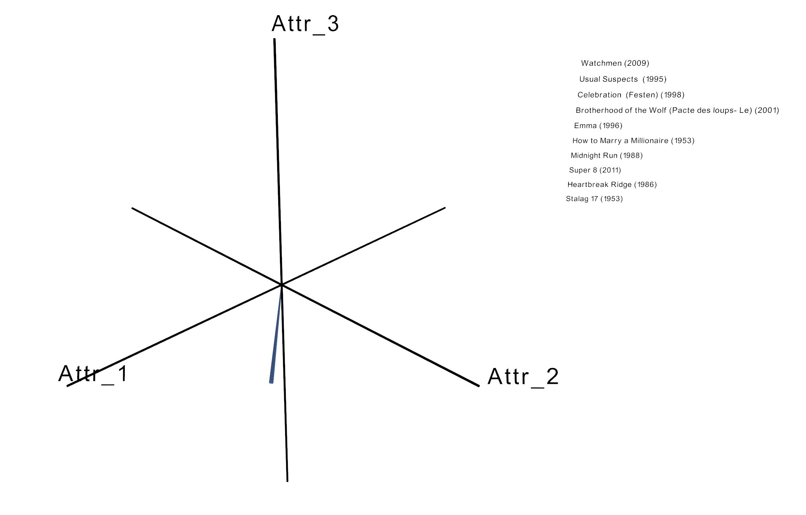
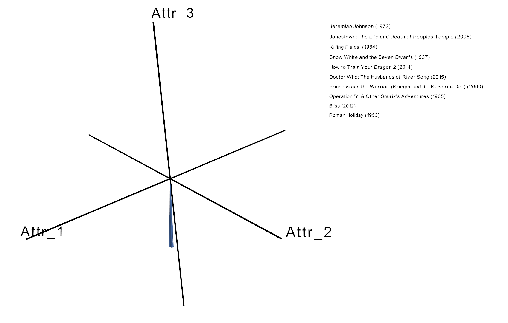
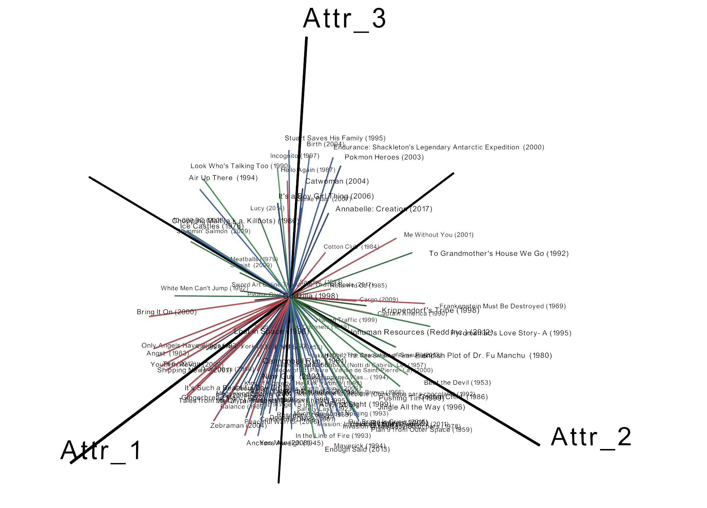

### Tutorial notebooks to run Parallel-PMF


```python
import numpy as np
import pandas as pd
import matplotlib.pyplot as plt
```


```python
%matplotlib inline
```


```python
from pmf import PMF
```


```python
model = PMF(indir='../movielens/', outdir='./example/', thread=20)
```

    Initializing model parameters...


#### Model training


```python
model.learn()
```

    Training model...
    Outdir "./example" exists
    Loading input matrix...
    Took 0.0371448 s. to load data. 
    
    [PMF] Initializing PMF with `data` size 70585 x 3 with k=3 std_beta=1 std_theta=1
    [PMF] Initialized 610 users in theta map 
    [PMF] Initialized 9724 items in beta map 
    [PMF] Initialization complete. 
    
    [fitParallel] Using 20 threads
    [fitParallel] Total epochs: 200
    [fitParallel] max rows: 70585
    [fitParallel] batch size: 3715
    [fitParallel] num batches: 19
    [fitParallel] Computing loss every 10 epochs
    
    [computeLossThread] Loss computation thread started.
    [fitParallel] Epoch: 10
    [computeLoss] Loss: -108941
    [fitParallel] Epoch: 20
    [computeLoss] Loss: -104476
    [fitParallel] Epoch: 30
    [computeLoss] Loss: -103534
    [fitParallel] Epoch: 40
    [computeLoss] Loss: -103133
    [fitParallel] Epoch: 50
    [computeLoss] Loss: -102940
    [fitParallel] Epoch: 60
    [computeLoss] Loss: -102765
    [fitParallel] Epoch: 70
    [computeLoss] Loss: -102689
    [fitParallel] Epoch: 80
    [computeLoss] Loss: -102603
    [fitParallel] Epoch: 90
    [computeLoss] Loss: -102564
    [fitParallel] Epoch: 100
    [computeLoss] Loss: -102539
    [fitParallel] Epoch: 110
    [computeLoss] Loss: -102513
    [fitParallel] Epoch: 120
    [computeLoss] Loss: -102512
    [fitParallel] Epoch: 130
    [computeLoss] Loss: -102488
    [fitParallel] Epoch: 140
    [computeLoss] Loss: -102461
    [fitParallel] Epoch: 150
    [computeLoss] Loss: -102453
    [fitParallel] Epoch: 160
    [computeLoss] Loss: -102441
    [fitParallel] Epoch: 170
    [computeLoss] Loss: -102439
    [fitParallel] Epoch: 180
    [computeLoss] Loss: -102430
    [fitParallel] Epoch: 190
    [computeLoss] Loss: -102427
    [fitParallel] Epoch: 200
    [computeLoss] Loss: -102427
    [computeLossThread] Loss computation thread completed.
    
    Running time for 200 iterations: 5.53387 s.
    
    RMSE(0): 1.28432
    RMSE(mean): 1.03827
    RMSE(pred): 0.964586
    Saving loss values...
    Saving model parameters...


```python
model.recommend_user(1)
```

    Loading previously learnt parameters into model...
    Top 10 recommended movies for user 1:


<div>
<style scoped>
    .dataframe tbody tr th:only-of-type {
        vertical-align: middle;
    }

    .dataframe tbody tr th {
        vertical-align: top;
    }

    .dataframe thead th {
        text-align: right;
    }
</style>
<table border="1" class="dataframe">
  <thead>
    <tr style="text-align: right;">
      <th></th>
      <th>title</th>
      <th>genre</th>
    </tr>
    <tr>
      <th>id</th>
      <th></th>
      <th></th>
    </tr>
  </thead>
  <tbody>
    <tr>
      <th>60684</th>
      <td>Watchmen (2009)</td>
      <td>Action|Drama|Mystery|Sci-Fi|Thriller|IMAX</td>
    </tr>
    <tr>
      <th>50</th>
      <td>Usual Suspects  (1995)</td>
      <td>Crime|Mystery|Thriller</td>
    </tr>
    <tr>
      <th>2360</th>
      <td>Celebration  (Festen) (1998)</td>
      <td>Drama</td>
    </tr>
    <tr>
      <th>5026</th>
      <td>Brotherhood of the Wolf (Pacte des loups- Le) ...</td>
      <td>Action|Mystery|Thriller</td>
    </tr>
    <tr>
      <th>838</th>
      <td>Emma (1996)</td>
      <td>Romance</td>
    </tr>
    <tr>
      <th>4357</th>
      <td>How to Marry a Millionaire (1953)</td>
      <td>Comedy|Drama|Romance</td>
    </tr>
    <tr>
      <th>3104</th>
      <td>Midnight Run (1988)</td>
      <td>Action|Comedy|Crime|Thriller</td>
    </tr>
    <tr>
      <th>87306</th>
      <td>Super 8 (2011)</td>
      <td>Mystery|Sci-Fi|Thriller|IMAX</td>
    </tr>
    <tr>
      <th>2476</th>
      <td>Heartbreak Ridge (1986)</td>
      <td>Action|War</td>
    </tr>
    <tr>
      <th>3196</th>
      <td>Stalag 17 (1953)</td>
      <td>Drama|War</td>
    </tr>
  </tbody>
</table>
</div>


#### Model recommendation & visualization

Display 


```python
model.recommend_items(87306)
```

    Top 10 recommended movies if you also like Super 8 (2011):


<div>
<style scoped>
    .dataframe tbody tr th:only-of-type {
        vertical-align: middle;
    }

    .dataframe tbody tr th {
        vertical-align: top;
    }

    .dataframe thead th {
        text-align: right;
    }
</style>
<table border="1" class="dataframe">
  <thead>
    <tr style="text-align: right;">
      <th></th>
      <th>title</th>
      <th>genre</th>
    </tr>
    <tr>
      <th>id</th>
      <th></th>
      <th></th>
    </tr>
  </thead>
  <tbody>
    <tr>
      <th>3196</th>
      <td>Stalag 17 (1953)</td>
      <td>Drama|War</td>
    </tr>
    <tr>
      <th>8484</th>
      <td>Human Condition I  (Ningen no joken I) (1959)</td>
      <td>Drama|War</td>
    </tr>
    <tr>
      <th>2476</th>
      <td>Heartbreak Ridge (1986)</td>
      <td>Action|War</td>
    </tr>
    <tr>
      <th>50</th>
      <td>Usual Suspects  (1995)</td>
      <td>Crime|Mystery|Thriller</td>
    </tr>
    <tr>
      <th>56339</th>
      <td>Orphanage  (Orfanato- El) (2007)</td>
      <td>Drama|Horror|Mystery|Thriller</td>
    </tr>
    <tr>
      <th>2436</th>
      <td>Tea with Mussolini (1999)</td>
      <td>Comedy|Drama|War</td>
    </tr>
    <tr>
      <th>60684</th>
      <td>Watchmen (2009)</td>
      <td>Action|Drama|Mystery|Sci-Fi|Thriller|IMAX</td>
    </tr>
    <tr>
      <th>3451</th>
      <td>Guess Who's Coming to Dinner (1967)</td>
      <td>Drama</td>
    </tr>
    <tr>
      <th>4357</th>
      <td>How to Marry a Millionaire (1953)</td>
      <td>Comedy|Drama|Romance</td>
    </tr>
    <tr>
      <th>8014</th>
      <td>Spring- Summer- Fall- Winter... and Spring (Bo...</td>
      <td>Drama</td>
    </tr>
  </tbody>
</table>
</div>


```python
model.recommend_items('Super 8 (2011)')
```

    Top 10 recommended movies if you also like Super 8 (2011):


<div>
<style scoped>
    .dataframe tbody tr th:only-of-type {
        vertical-align: middle;
    }

    .dataframe tbody tr th {
        vertical-align: top;
    }

    .dataframe thead th {
        text-align: right;
    }
</style>
<table border="1" class="dataframe">
  <thead>
    <tr style="text-align: right;">
      <th></th>
      <th>title</th>
      <th>genre</th>
    </tr>
    <tr>
      <th>id</th>
      <th></th>
      <th></th>
    </tr>
  </thead>
  <tbody>
    <tr>
      <th>3196</th>
      <td>Stalag 17 (1953)</td>
      <td>Drama|War</td>
    </tr>
    <tr>
      <th>8484</th>
      <td>Human Condition I  (Ningen no joken I) (1959)</td>
      <td>Drama|War</td>
    </tr>
    <tr>
      <th>2476</th>
      <td>Heartbreak Ridge (1986)</td>
      <td>Action|War</td>
    </tr>
    <tr>
      <th>50</th>
      <td>Usual Suspects  (1995)</td>
      <td>Crime|Mystery|Thriller</td>
    </tr>
    <tr>
      <th>56339</th>
      <td>Orphanage  (Orfanato- El) (2007)</td>
      <td>Drama|Horror|Mystery|Thriller</td>
    </tr>
    <tr>
      <th>2436</th>
      <td>Tea with Mussolini (1999)</td>
      <td>Comedy|Drama|War</td>
    </tr>
    <tr>
      <th>60684</th>
      <td>Watchmen (2009)</td>
      <td>Action|Drama|Mystery|Sci-Fi|Thriller|IMAX</td>
    </tr>
    <tr>
      <th>3451</th>
      <td>Guess Who's Coming to Dinner (1967)</td>
      <td>Drama</td>
    </tr>
    <tr>
      <th>4357</th>
      <td>How to Marry a Millionaire (1953)</td>
      <td>Comedy|Drama|Romance</td>
    </tr>
    <tr>
      <th>8014</th>
      <td>Spring- Summer- Fall- Winter... and Spring (Bo...</td>
      <td>Drama</td>
    </tr>
  </tbody>
</table>
</div>


```python
model.recommend_genre('Action')
```

    Top 10 recommended movies for genre Action:


<div>
<style scoped>
    .dataframe tbody tr th:only-of-type {
        vertical-align: middle;
    }

    .dataframe tbody tr th {
        vertical-align: top;
    }

    .dataframe thead th {
        text-align: right;
    }
</style>
<table border="1" class="dataframe">
  <thead>
    <tr style="text-align: right;">
      <th></th>
      <th>title</th>
      <th>genre</th>
    </tr>
    <tr>
      <th>id</th>
      <th></th>
      <th></th>
    </tr>
  </thead>
  <tbody>
    <tr>
      <th>3114</th>
      <td>Toy Story 2 (1999)</td>
      <td>Adventure|Animation|Children|Comedy|Fantasy</td>
    </tr>
    <tr>
      <th>5955</th>
      <td>Antwone Fisher (2002)</td>
      <td>Drama</td>
    </tr>
    <tr>
      <th>27820</th>
      <td>Story of the Weeping Camel  (Geschichte vom we...</td>
      <td>Documentary|Drama</td>
    </tr>
    <tr>
      <th>2991</th>
      <td>Live and Let Die (1973)</td>
      <td>Action|Adventure|Thriller</td>
    </tr>
    <tr>
      <th>56251</th>
      <td>Futurama: Bender's Big Score (2007)</td>
      <td>Animation|Comedy|Sci-Fi</td>
    </tr>
    <tr>
      <th>1466</th>
      <td>Donnie Brasco (1997)</td>
      <td>Crime|Drama</td>
    </tr>
    <tr>
      <th>5637</th>
      <td>Flirting (1991)</td>
      <td>Drama</td>
    </tr>
    <tr>
      <th>3652</th>
      <td>City of the Living Dead (a.k.a. Gates of Hell ...</td>
      <td>Horror</td>
    </tr>
    <tr>
      <th>3702</th>
      <td>Mad Max (1979)</td>
      <td>Action|Adventure|Sci-Fi</td>
    </tr>
    <tr>
      <th>1240</th>
      <td>Terminator  (1984)</td>
      <td>Action|Sci-Fi|Thriller</td>
    </tr>
  </tbody>
</table>
</div>


```python
model.display_loss()
```


    

    


```python
model.display_user(1, interactive=False)
```

    Spatial visualization of top 10 recommended movies for user 1...
    Top 10 recommended movies for user 1:
                                                       title  \
    id                                                         
    60684                                    Watchmen (2009)   
    50                                Usual Suspects  (1995)   
    2360                        Celebration  (Festen) (1998)   
    5026   Brotherhood of the Wolf (Pacte des loups- Le) ...   
    838                                          Emma (1996)   
    
                                               genre  
    id                                                
    60684  Action|Drama|Mystery|Sci-Fi|Thriller|IMAX  
    50                        Crime|Mystery|Thriller  
    2360                                       Drama  
    5026                     Action|Mystery|Thriller  
    838                                      Romance  


    

    


```python
model.display_item(260, interactive=False)
```

    Spatial visualization of top 10 similar movies for item Star Wars: Episode IV - A New Hope (1977)...
    Top 10 recommended movies if you also like Star Wars: Episode IV - A New Hope (1977):
                                                        title  \
    id                                                          
    3074                              Jeremiah Johnson (1972)   
    53024   Jonestown: The Life and Death of Peoples Templ...   
    1299                               Killing Fields  (1984)   
    594                Snow White and the Seven Dwarfs (1937)   
    112175                  How to Train Your Dragon 2 (2014)   
    
                                               genre  
    id                                                
    3074                                     Western  
    53024                                Documentary  
    1299                                   Drama|War  
    594     Animation|Children|Drama|Fantasy|Musical  
    112175                Action|Adventure|Animation  


    

    


```python
model.display_random(N=5, n_neighbors=20, interactive=False)
```

    Spatial visualization of the neighbors of 5 random items


    

    


### Interactive plots

Please install `mayavi` by following the [official instruction](https://docs.enthought.com/mayavi/mayavi/installation.html) or by running the following commands: 
```bash
pip install mayavi
pip install PyQt5
```

For jupyter notebook interactive plot, please run the addition commnads:
```bash
jupyter nbextension install --py mayavi --user
jupyter nbextension enable --py mayavi --user
```

Some sample command options and output of corresponding plots are shown here:


```python
model.display_user(1, interactive=True, show_title=True)
```

    Spatial visualization of top 10 recommended movies for user 1...
    Top 10 recommended movies for user 1:
                                                       title  \
    id                                                         
    60684                                    Watchmen (2009)   
    50                                Usual Suspects  (1995)   
    2360                        Celebration  (Festen) (1998)   
    5026   Brotherhood of the Wolf (Pacte des loups- Le) ...   
    838                                          Emma (1996)   
    
                                               genre  
    id                                                
    60684  Action|Drama|Mystery|Sci-Fi|Thriller|IMAX  
    50                        Crime|Mystery|Thriller  
    2360                                       Drama  
    5026                     Action|Mystery|Thriller  
    838                                      Romance  





```python
model.display_item(260, interactive=True, show_title=True)
```

    Spatial visualization of top 10 similar movies for item Star Wars: Episode IV - A New Hope (1977)...
    Top 10 recommended movies if you also like Star Wars: Episode IV - A New Hope (1977):
                                                        title  \
    id                                                          
    3074                              Jeremiah Johnson (1972)   
    53024   Jonestown: The Life and Death of Peoples Templ...   
    1299                               Killing Fields  (1984)   
    594                Snow White and the Seven Dwarfs (1937)   
    112175                  How to Train Your Dragon 2 (2014)   
    
                                               genre  
    id                                                
    3074                                     Western  
    53024                                Documentary  
    1299                                   Drama|War  
    594     Animation|Children|Drama|Fantasy|Musical  
    112175                Action|Adventure|Animation  





```python
model.display_random(N=100, n_neighbors=1, show_title=True)
```

    Spatial visualization of the neighbors of 100 random items





```python

```
